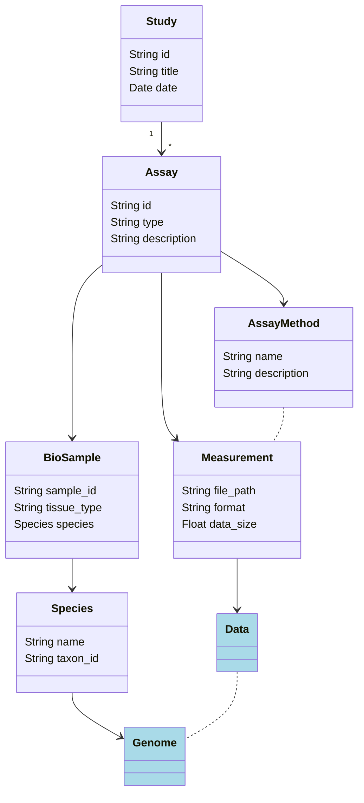

# BioinfoTools2.jl

A second attempt at creating a comprehensive suite of bioinformatics tools in pure Julia.

- [Getting Started](#getting-started)
- [Package Structure](#package-structure)
- [Author](#author)

## Getting Started

## Package Structure
As the purpose of this package is to allow for the easy organization, analysis and manipulation of bioinformatics data, every type unique to this package is organized hierarchically in a [*Study*](<./src/study.jl>):

As shown, a `Study` is composed of one or more `Assay`'s. An `Assay` contains a `Measurement` with processed data (currently either BED/interval-based data or tabular data).

## Author
Tom Wolfe 
e-mail: thomas_wolfe@student.uml.edu 
github: [tdw-89](<https://github.com/tdw-89>) 